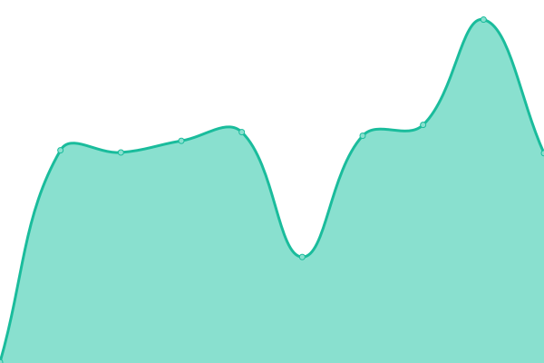

# [📈 Live Status](https://bcgov.github.io/upptime): <!--live status--> **🟩 All systems operational**

This repository contains the open-source uptime monitor and status page for [Province of British Columbia](https://github.com/bcgov/BC-Policy-Framework-For-GitHub), powered by [Upptime](https://github.com/upptime/upptime).

With [Upptime](https://upptime.js.org), you can get your own unlimited and free uptime monitor and status page, powered entirely by a GitHub repository. We use [Issues](https://github.com/bcgov/upptime/issues) as incident reports, [Actions](https://github.com/bcgov/upptime/actions) as uptime monitors, and [Pages](https://bcgov.github.io/upptime) for the status page.

<!--start: status pages-->
<!-- This summary is generated by Upptime (https://github.com/upptime/upptime) -->
<!-- Do not edit this manually, your changes will be overwritten -->
<!-- prettier-ignore -->
| URL | Status | History | Response Time | Uptime |
| --- | ------ | ------- | ------------- | ------ |
|  [namex-api](https://namex.apps.silver.devops.gov.bc.ca/api/v1/nr-ops/healthz) | 🟩 Up | [namex-api.yml](https://github.com/bcgov/upptime/commits/HEAD/history/namex-api.yml) | 

 242ms
     
 | 

<a href="https://bcgov.github.io/upptime/history/namex-api">78.48%</a>
    

|  [legal-api](https://legal-api.apps.silver.devops.gov.bc.ca/ops/healthz) | 🟩 Up | [legal-api.yml](https://github.com/bcgov/upptime/commits/HEAD/history/legal-api.yml) | 

 817ms
     
 | 

<a href="https://bcgov.github.io/upptime/history/legal-api">99.40%</a>
    

|  [auth-api](https://auth-api.apps.silver.devops.gov.bc.ca/ops/healthz) | 🟩 Up | [auth-api.yml](https://github.com/bcgov/upptime/commits/HEAD/history/auth-api.yml) | 

 233ms
     
 | 

<a href="https://bcgov.github.io/upptime/history/auth-api">99.14%</a>
    

|  [pay-api](https://pay-api.apps.silver.devops.gov.bc.ca/ops/healthz) | 🟩 Up | [pay-api.yml](https://github.com/bcgov/upptime/commits/HEAD/history/pay-api.yml) | 

 1032ms
     
 | 

<a href="https://bcgov.github.io/upptime/history/pay-api">99.41%</a>
    

<!--end: status pages-->

[**Visit our status website →**](https://bcgov.github.io/upptime)

## 📄 License

- Powered by: [Upptime](https://github.com/upptime/upptime)
- Code: [MIT](./LICENSE) © [Province of British Columbia](https://github.com/bcgov/BC-Policy-Framework-For-GitHub)
- Data in the `./history` directory: [Open Database License](https://opendatacommons.org/licenses/odbl/1-0/)
